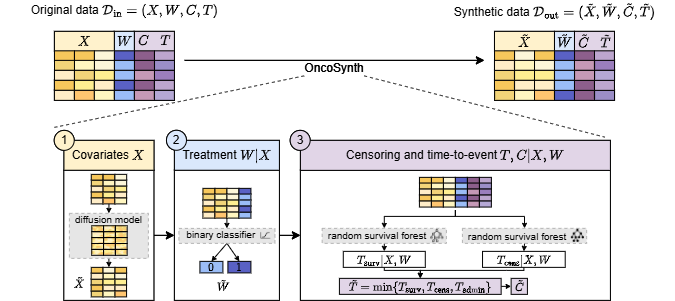

# OncoSynth

**Synthetic data generation for treatment effect estimation in oncology**

OncoSynth is a framework for generating synthetic oncology cohorts that support treatment effect estimation.


<p align="center">
  
</p>

## Overview

This repository contains:

- the **OncoSynth model implementation** for generating synthetic cohorts (see [Using OncoSynth](#using-oncosynth))
- **cohort cleaning scripts** for reproducing the SEER-derived lung and breast cancer cohorts used in the paper (see [`cleaning/README_cohorts.md`](cleaning/README_cohorts.md))
- the **paper experiment workflow**, including baseline generators and evaluation scripts for statistical fidelity and treatment-effect utility (see [`README_experiments.md`](README_experiments.md))
- a **small demo dataset** for testing the code end-to-end (see [`data/clean/demo_cohort.csv`](data/clean/demo_cohort.csv))

The main experiments in the paper use two cohorts derived from the Surveillance, Epidemiology, and End Results (SEER) Research Database of the National Cancer Institute, version 9.0.43. SEER data are publicly available subject to a data-use agreement: [https://seer.cancer.gov/](https://seer.cancer.gov/). Detailed instructions for SEER export and cohort cleaning are provided in: [`cleaning/README_cohorts.md`](cleaning/README_cohorts.md).

- a **lung cancer cohort**, where the treatment is radiotherapy vs. no radiotherapy;
- a **breast cancer cohort**, where the treatment is adjuvant vs. neoadjuvant chemotherapy.

The demo cohort is provided only as a lightweight example to check that the code runs end-to-end.

## Using OncoSynth
OncoSynth expects a cohort with patient covariates, a binary treatment variable, a time-to-event outcome, and a censoring indicator. Before running the pipeline, the cohort must be added to the generation configuration file.

### Dependencies
The main dependencies for running OncoSynth are listed in [`requirements_generation.yaml`](requirements_generation.yaml). To simplify setup, we provide a script below for creating the software environment and installing the required dependencies [`create_gen_env.sh`](create_gen_env.sh).

The pipeline can be run on a normal computer. For full-scale experiments, a GPU is recommended. Typical installation takes a few minutes.

### 1. Create the generation environment

Create the conda environment using the predefined requirements:

```bash
./create_gen_env.sh
conda activate gen_env
```

### 2. Format your data

Your input cohort should contain one row per patient. The columns correspond to:
- covariates: continuous and/or categorical variables, encoded numerically;
- treatment: binary treatment indicator, encoded as 0/1;
- censoring/event indicator: binary indicator, encoded as 0 for censored and 1 for observed event;
- survival time: positive numeric value, e.g. survival or follow-up time in months.

The expected column names, paths, and cohort-specific settings are defined in the config file. Before running OncoSynth on a new cohort, add or update the corresponding cohort entry in: 
```bash
generation/config.yaml
```

### 3. Prepare your data
Run the preparation script:
```bash
python generation/prepare.py --cohort <cohort_name> --seed <seed>

# Example using a SEER-derived lung cancer cohort:
python generation/prepare.py --cohort lung --seed 0
```

This creates a cohort folder named:
```bash
<cohort_name>_<seed>, e.g., lung_0, demo_0
```

### 4. Run OncoSynth
Train the OncoSynth generator on the prepared cohort. The `--cohort_seed` used for training and generation must match the `--seed` used during preparation:

```bash
python generation/train_oncosynth.py \
  --cohort <cohort_name> \
  --gpu <gpu_id> \
  --cohort_seed <seed>

# Example: SEER-derived lung cancer cohort
python generation/train_oncosynth.py \
  --cohort lung \
  --gpu 0 \
  --cohort_seed 0
  
```

Generate the synthetic cohort:

```bash
python generation/generate_oncosynth.py \
  --cohort <cohort_name> \
  --gpu <gpu_id> \
  --cohort_seed <seed>

# Example: SEER-derived lung cancer cohort
python generation/generate_oncosynth.py \
  --cohort lung \
  --gpu 0 \
  --cohort_seed 0

```

### Minimal example
We provide a demo cohort that can be used as a quick end-to-end test that the software has been installed correctly. Expected runtime for training OncoSynth is approximately one hour. Generation of synthetic data takes a few minutes.

```bash
./create_gen_env.sh
conda activate gen_env

python generation/prepare.py --cohort demo --seed 0

python generation/train_oncosynth.py --cohort demo --gpu 0 --cohort_seed 0
python generation/generate_oncosynth.py --cohort demo --gpu 0 --cohort_seed 0
```

The expected outputs are written to:
```bash
data/prepared/demo_out
data/models/demo_out
data/runs/demo_out
```

## Third-party code

OncoSynth uses and adapts components from the TabDiff repository for tabular diffusion modeling. The adapted code is included in `generation/third_party/`.

We thank the TabDiff authors for making their implementation available. For details on the original repository, see the [TabDiff repository](https://github.com/MinkaiXu/TabDiff) and [`generation/third_party/README.md`](generation/third_party/README.md).


## License

This repository is released under the MIT License. See [LICENSE](LICENSE) for details.
